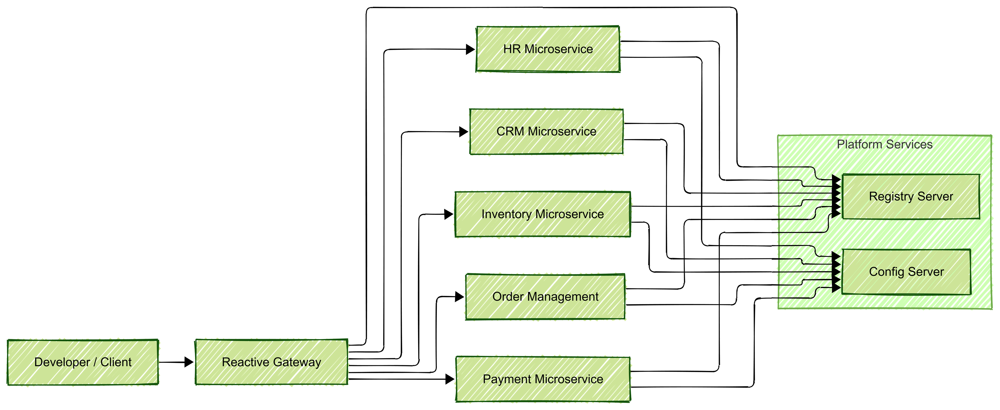

# DCL-350: Implementing MicroService Architecture using Spring Cloud

These projects are created as part of the following training: **DCL-350**: *Implementing MicroService Architecture using Spring Cloud*

## Training & Resources

- Training catalog (official): https://www.deepcloudlabs.com/resources

## What’s inside (high-level)

The labs cover a practical microservices stack and patterns, including:

- **Service Discovery** (Registry)
- **Centralized Configuration** (Config Server)
- **API Gateway (Reactive)** for edge routing
- **DDD / Hexagonal Architecture** oriented modules
- **CQRS** (separate read/write models)
- **Event Sourcing / Saga** style workflows (where applicable)
- **Resilience patterns** with **Resilience4j**
- Reactive programming and integration exercises

## Repository Structure

Core platform components:
- `config-server/` — Spring Cloud Config Server
- `registry-server/` — Service registry (e.g., Eureka-style discovery)
- `reactive-gateway/` — Reactive API gateway (edge routing)

Business-oriented services & labs:
- `crm-reactive-microservice/`
- `crm-read-model-microservice/`
- `crm-write-model-microservice/`
- `hr-core-subdomain/` — HR domain building blocks / shared domain
- `hr-microservice/`
- `inventory-microservice/`
- `order-management-microservice/`
- `payment-microservice/`
- `security-card-microservice/`
- `lottery-microservice/`
- `lottery-consumer-microservice/`

Client / integration / study modules:
- `hr-websocket-client-nodejs/` — Node.js client for WebSocket exercises
- `integration-javase/` — Java SE integration exercises
- `study-reactive-programming-javase/` — Reactive programming study set
- `study-resiliency-patterns/` — Resilience patterns lab set

## Suggested Runtime Architecture

## Troubleshooting (Common Pitfalls)

- Config not loading: Confirm the config server is up before starting dependent services.
- Service discovery issues: Ensure the registry is running and the service names match registration config.
- Gateway routes not working: Validate route definitions and the target service registration state.
- Port conflicts: If you run multiple services locally, ensure ports don’t collide (adjust per module configs).
  
## License

MIT License.

## Acknowledgements

These projects are maintained as part of DeepCloudLabs training delivery for DCL-350.

## Kurulum Bilgisi:

Eğitimde lab çalışmaları için gerekli olan çalışma ortamının kurulumu için öncelikle aşağıdaki bağlantıda yer alan sıkıştırılmış dosyayı makinanıza indirmeniz gerekiyor: DEVEL-stage-2025b-java.se.and.spring.zip

Sıkıştırılmış dosyayı **C:\\** dizinine açtıktan sonra dizin yapısı aşağıda gösterildiği şekilde olacaktır:

Diskinizdeki dizin yapısını yukarıdaki ile karşılaştırarak kontrol ediniz. **C:** sürücünüzün dolu dolması durumunda farklı bir sürücüye sıkıştırılmış dosyayı açabilirsiniz. Ancak bu durumda bir kaç konfigürasyon dosyasında değişiklik yapmanız gerekecektir. Lütfen, eğitim sırasında bu değişikliklerin neler olduğunu eğitmeninize sorunuz. 
